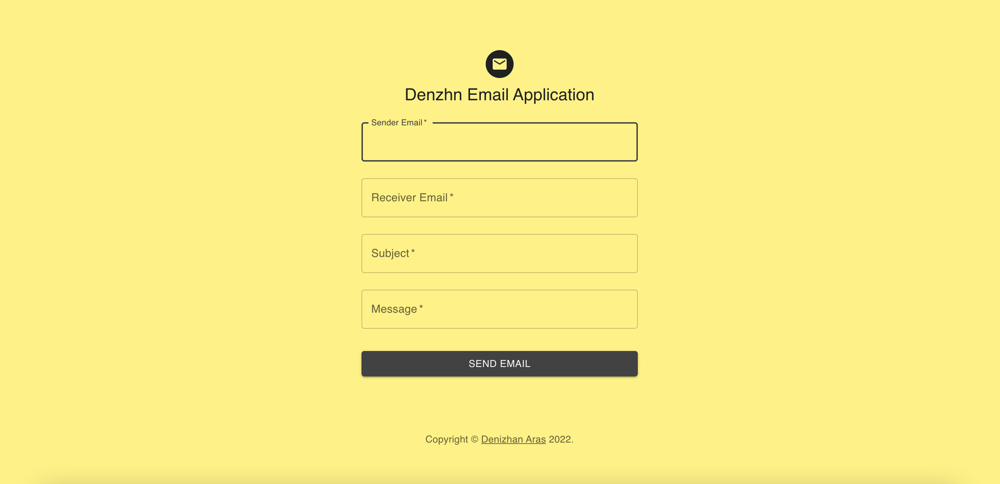
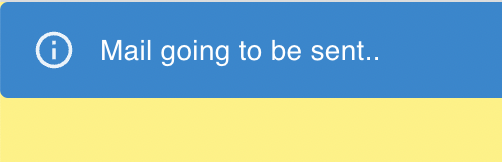
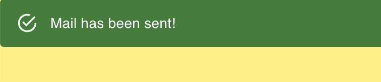
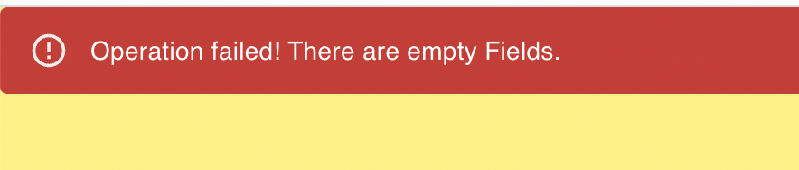

# Spring Mail App
## _Made with Spring Framework by Denizhan Aras_

With this form application you can send Emails to a valid email address you want. This app requires a smtp server to run. Check application.properties for your configurations.

- Made with Spring Boot & ReactJs & MUI Components.
- Back-end serves at `https://localhost:8080`
- Front-end serves at `https://localhost:3000`
- You can run both of them directly:
  - Run Spring App from IDE.
  - Go to project's root folder from a terminal:
    - Type `cd react-mail` module.
    - Type `npm i` to install required packages.
    - Type `npm start` to run ReactJs app.
- Test request available as a POSTMAN json set at project's root repository.
  - Import json to the POSTMAN to test app.
- Check below for details.

## Send Email Screen
- All fields must be non-empty to send an email.
- Field validation were made at back-end.
- Sender email can be any address you want.
- Receiver's address should be a valid & real email address.

## Alerts
- Alerts will be shown up at the top of the website to inform user.

